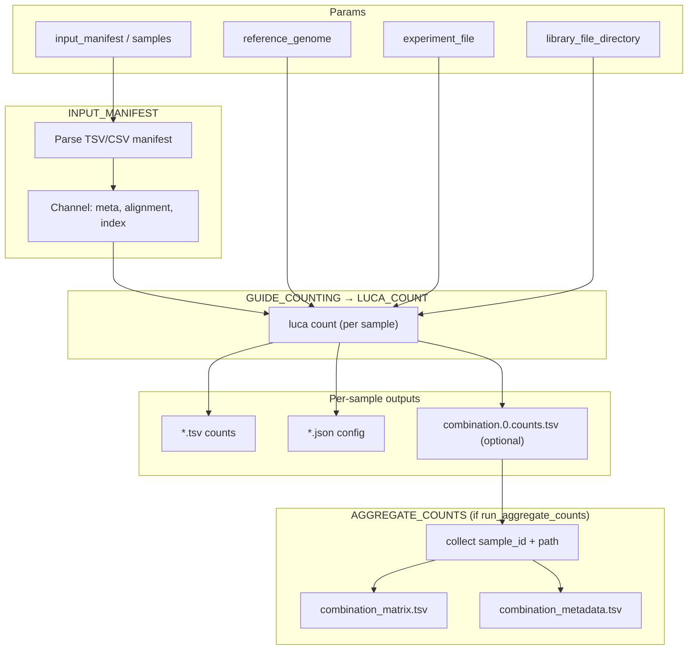

# toy-crispr-pipeline

[](https://www.nextflow.io/)
[](https://www.docker.com/)
[](https://sylabs.io/docs/)

## Introduction

This is a simple bioinfromatics pipeline written in [Nextflow](http://www.nextflow.io) for mutliplexed crispr counting using [LUCA]((https://gitlab.internal.sanger.ac.uk/casm/crispr/crispr-lib-matching)) – CASM-IT's latest generation CRISPR-tool.

## Pipeline summary

In brief, the pipeline takes a set BAM/CRAM files containing CRISPR reads a set of CRISPR library files containing guide sequences, and an experiment file and generates counts for each of the guides in the CRISPR library file.

## Steps: 
1. **INPUT_MANIFEST** — read a sample manifest (CRAM/BAM)
2. **LUCA_COUNT** (per sample) — run `luca count` with the experiment YAML and library directory.
3. **AGGREGATE_COUNTS** (optional) — merge per-sample `combination.0.counts.tsv` into one wide matrix.

## Inputs
- `samples manifest`: Path to a sample list file that pointing to a set of CRAM files and their indexes. Create a TSV (or CSV) with a header row. Supported headers: `filepath,index` or `file,index`. (see `inputs/sample_list.tsv`) for an example.
- `reference_genome`: Path to the reference genome used in generating CRAM files

This can be provided in the params.yaml 

Copy and edit `inputs/example_run_params.yaml`:

```yaml
input_manifest: "/lustre/.../inputs/sample_list_bam.tsv"
reference_genome: "/lustre/scratch124/.../genome.fa"
experiment_file: "/lustre/.../inputs/experiment.yaml"
library_file_directory: "/lustre/.../libraries"
outdir: "/lustre/.../results/my_run"

run_luca_count: true
run_aggregate_counts: false   # set true for dual-guide combination matrix

luca_count_mm_reads: true
luca_sort_mm_read_counts: true
luca_cpus: 8
luca_extra_args: ""
```
- `experiment_file`: Path to a CRISPR-lib-matching experiment file `.yaml`. See [LUCA](https://gitlab.internal.sanger.ac.uk/casm/crispr/crispr-lib-matching) for a more thorough explanation.
- `library_file_directory`: Path to a directory containing the guide sequence files used in a screen
- `outdir`: Path to output results.


## Usage 

The recommended way to launch this pipeline is using a wrapper script (e.g. `bsub < my_wrapper.sh`) that submits nextflow as a job and records the version (**e.g.** `-r 0.1.0`)  and the `.json` parameter file supplied for a run.

An example wrapper script:
```
#!/bin/bash
#BSUB -q oversubscribed
#BSUB -G team113-grp
#BSUB -R "select[mem>2000] rusage[mem=2000] span[hosts=1]"
#BSUB -M 2000
#BSUB -oo nf_out.o
#BSUB -eo nf_out.e

PARAMS_FILE="tests/testdata/example_params.json"

# Load module dependencies
module load nextflow-23.10.0
module load /software/modules/ISG/singularity/3.11.4

# Create a nextflow job that will spawn other jobs

nextflow run 'https://gitlab.internal.sanger.ac.uk/team113sanger/team113_crispr/toy-crispr-pipeline' \
-r 0.1.0 \
-params-file $PARAMS_FILE \
-profile farm22 
```

The pipeline can configured to run on either Sanger OpenStack secure-lustre instances or farm22 by changing the profile speicified:
`-profile secure_lustre` or `-profile farm22`. 


## Aggregation (`run_aggregate_counts`)

For dual-guide screens, LUCA writes `combination.0.counts.tsv` per sample (tab-separated rows: locus A, locus B, count).

When `run_aggregate_counts: true`, the pipeline:

1. Collects `[sample_id, path]` for every sample that produced combination counts.
2. Runs one **AGGREGATE_COUNTS** job that pivots those files into a wide matrix (`combination_id` × samples).

Leave `run_aggregate_counts: false` for single-guide screens. 

## Pipeline visualisation
Created using nextflow's in-built visualitation features.
```
nextflow run main.nf -preview -with-dag -params-file tests/testdata/test_params.json flowchart.mmd
```



## Testing

This pipeline has been developed with the [nf-test](http://nf-test.com) testing framework. Unit tests and small test data are provided within the pipeline `test` subdirectory. A snapshot has been taken of the outputs of most steps in the pipeline to help detect regressions when editing. You can run all tests on openstack with:

```
nf-test test 
```
and individual tests with:
```
nf-test test tests/modules/ascat_exomes.nf.test
```

For faster testing of the flow of data through the pipeline **without running any of the tools involved**, stubs have been provided to mock the results of each succesful step.
```
nextflow run main.nf \
-params-file params.json \
-c tests/nextflow.config \
--stub-run
```